# MissileCOOMand

Integrantes:    
 ~ Joaquin Olmedo  
 ~  Denis Lautaro

## Patron Strategy

El movimiento de los misiles se delega a `IMovementStrategy`, que permite intercambiar
algoritmos sin modificar `Misil` ni `PlayerMisil`. `LinearMovementStrategy` conserva
el movimiento lineal actual por defecto; `DirectMovementStrategy` recalcula el rumbo
y ajusta el ultimo paso para no sobrepasar el objetivo.

Se puede elegir una estrategia al crear un misil mediante el constructor que recibe
`IMovementStrategy`, o cambiarla durante la ejecucion con `setMovementStrategy`.

## Diagrama de clases

El diagrama incluye las clases e interfaces propias del proyecto. Las dependencias de
Swing, AWT, audio y colecciones se muestran solo cuando ayudan a entender una relacion.

```mermaid
classDiagram
    namespace modelo {
        class GameFrame {
            +GameFrame()
            +main(String[] args) void
        }
        class MainMenu {
            +MainMenu()
            +main(String[] args) void
        }
        class MissileComand {
            ~enemyMissiles : ArrayList~Misil~
            ~counterMissiles : ArrayList~PlayerMisil~
            ~cities : ArrayList~City~
            ~explosions : ArrayList~Explosion~
            -missileSpawnClock : int
            -maxMisil : int
            -misilCount : int
            -score : int
            -lastShotTime : long
            -SHOT_COOLDOWN_MS : long
            -bgmClip : Clip
            -shootClip : Clip
            -timer : Timer
            -lastTime : long
            -baseX : int
            -baseY : int
            +COLLISION_RADIUS : int
            +MissileComand()
            +paintComponent(Graphics g) void
            +actionPerformed(ActionEvent e) void
            +mousePressed(MouseEvent e) void
            -allCitiesDestroyed() boolean
            -resetGame() void
            -showGameOverDialog() void
            +mouseReleased(MouseEvent e) void
            +mouseClicked(MouseEvent e) void
            +mouseEntered(MouseEvent e) void
            +mouseExited(MouseEvent e) void
        }
        class GameObjectStart {
            <<abstract>>
            #x : int
            #y : int
            +GameObjectStart(int x, int y)
            +getX() int
            +getY() int
        }
        class City {
            -name : String
            -health : int
            -destroyed : boolean
            -explosionGif : Image
            -explosionTimerMs : long
            -DURATION : long
            -urlImagen : URL
            -explosionClips : Clip[]
            -soundPlayed : boolean
            +City(String name, int x, int y)
            +takeDamage(int amount) void
            -playRandomExplosion() void
            +update(long deltaMs) void
            +isDestroyed() boolean
            +reset() void
            +draw(Graphics g) void
        }
        class GameObjectTarget {
            <<abstract>>
            #x : double
            #y : double
            #targetX : int
            #targetY : int
            #startX : int
            #startY : int
            -movementStrategy : IMovementStrategy
            +GameObjectTarget(int x, int y, int targetX, int targetY, IMovementStrategy strategy)
            +move(long deltaMs) void
            +setMovementStrategy(IMovementStrategy strategy) void
            +getX() int
            +getY() int
        }
        class Misil {
            -SPEED : double
            -markedForRemoval : boolean
            +Misil(int x, int y, int targetX, int targetY)
            +Misil(int x, int y, int targetX, int targetY, IMovementStrategy strategy)
            +update(long deltaMs) void
            +hasReachedTarget() boolean
            +draw(Graphics2D g2) void
            +markForRemoval() void
            +isMarkedForRemoval() boolean
        }
        class PlayerMisil {
            -SPEED : double
            +PlayerMisil(int x, int y, int targetX, int targetY)
            +PlayerMisil(int x, int y, int targetX, int targetY, IMovementStrategy strategy)
            +update(long deltaMs) void
            +hasReachedTarget() boolean
            +draw(Graphics2D g2, int baseX, int baseY) void
            +getTargetX() int
            +getTargetY() int
        }
        class Explosion {
            -x : int
            -y : int
            -maxRadius : int
            -radius : int
            -durationMs : int
            -elapsedTime : int
            +Explosion(int x, int y)
            +update(long deltaMs) void
            +isFinished() boolean
            +hits(Misil misil) boolean
            +draw(Graphics2D g2) void
        }
        class IMovementStrategy {
            <<interface>>
            +move(GameObjectTarget object, long deltaMs) void
        }
        class LinearMovementStrategy {
            -speed : double
            +LinearMovementStrategy(double speed)
            +move(GameObjectTarget object, long deltaMs) void
        }
        class DirectMovementStrategy {
            -speed : double
            +DirectMovementStrategy(double speed)
            +move(GameObjectTarget object, long deltaMs) void
        }
        class ScoreManager {
            <<utility>>
            -FILE_NAME : String
            +loadScores() List~ScoreEntry~
            +saveScores(List~ScoreEntry~ scores) void
            -inicializarScores(List~ScoreEntry~ scores) void
        }
        class ScoreEntry {
            -name : String
            -score : int
            +ScoreEntry(String name, int score)
            +getName() String
            +getScore() int
            +compareTo(ScoreEntry o) int
            +toString() String
        }
    }
    namespace interfaces {
        class IUpdatable {
            <<interface>>
            +update(long deltaMs) void
        }
        class IReachTarget {
            <<interface>>
            +hasReachedTarget() boolean
        }
    }

    GameObjectStart <|-- City
    GameObjectTarget <|-- Misil
    GameObjectTarget <|-- PlayerMisil
    IUpdatable <|.. City
    IUpdatable <|.. Misil
    IUpdatable <|.. PlayerMisil
    IReachTarget <|.. Misil
    IReachTarget <|.. PlayerMisil
    IMovementStrategy <|.. LinearMovementStrategy
    IMovementStrategy <|.. DirectMovementStrategy
    Comparable <|.. ScoreEntry : implementa
    JFrame <|-- GameFrame : extiende
    JFrame <|-- MainMenu : extiende
    JPanel <|-- MissileComand : extiende
    MissileComand ..|> ActionListener : implementa
    MissileComand ..|> MouseListener : implementa

    GameFrame *-- MissileComand : contiene panel
    MainMenu ..> GameFrame : inicia juego
    MissileComand "1" *-- "0..*" Misil : misiles enemigos
    MissileComand "1" *-- "0..*" PlayerMisil : misiles del jugador
    MissileComand "1" *-- "4" City : ciudades
    MissileComand "1" *-- "0..*" Explosion : explosiones
    GameObjectTarget "1" --> "1" IMovementStrategy : delega movimiento
    Explosion ..> Misil : comprueba impacto
    MainMenu ..> ScoreManager : consulta puntajes
    MainMenu ..> ScoreEntry : muestra puntajes
    MissileComand ..> ScoreManager : carga y guarda puntajes
    MissileComand ..> ScoreEntry : registra resultado
    ScoreManager ..> ScoreEntry : persiste entradas
```

