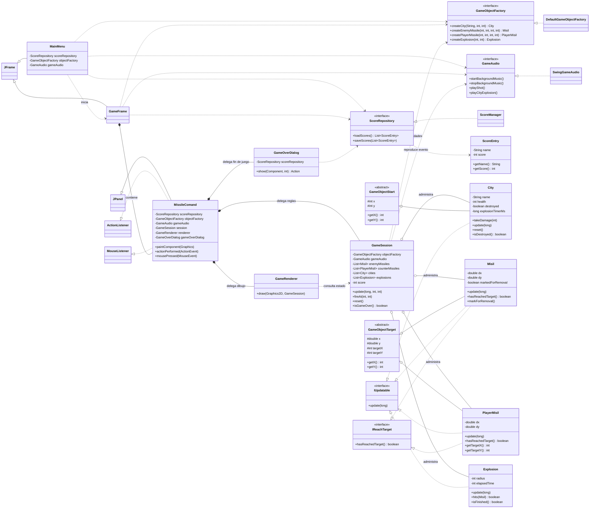

# Diagrama de clases

El diagrama muestra las relaciones principales de la estructura actual. Las flechas punteadas representan dependencias o implementaciones de interfaces; los rombos representan objetos contenidos por otro componente.

